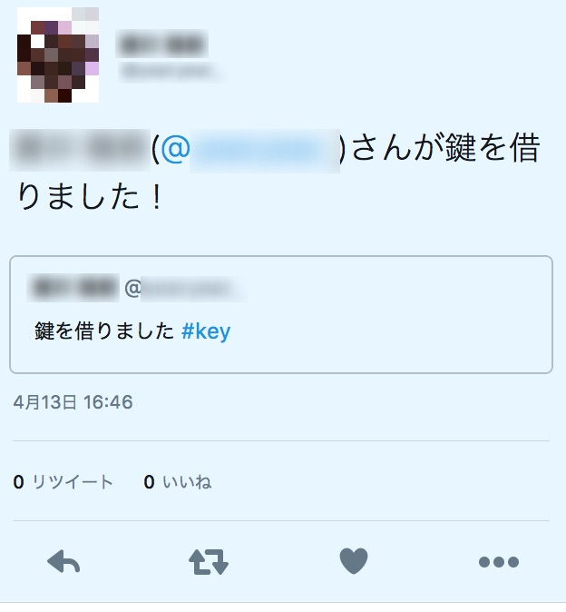

# TweetBot
## 概要
- 指定したハッシュタグを検出した場合、どのユーザがハッシュタグを呟いたかをツイートするBotである
- あらかじめ部室を借りたことを示すハッシュタグは決めてあるため、特定のハッシュタグをツイートすることで誰が部室を借りたかがわかる
## 具体例
- ここでは #key が検出用ハッシュタグとする

1.ハッシュタグをつけツイートする

2.Bot用アカウントから名前、スクリーンネーム、引用ツイートがツイートされる

## 使用したライブラリ
- [tweepy v3.5.0](http://tweepy.readthedocs.io/en/v3.5.0/)